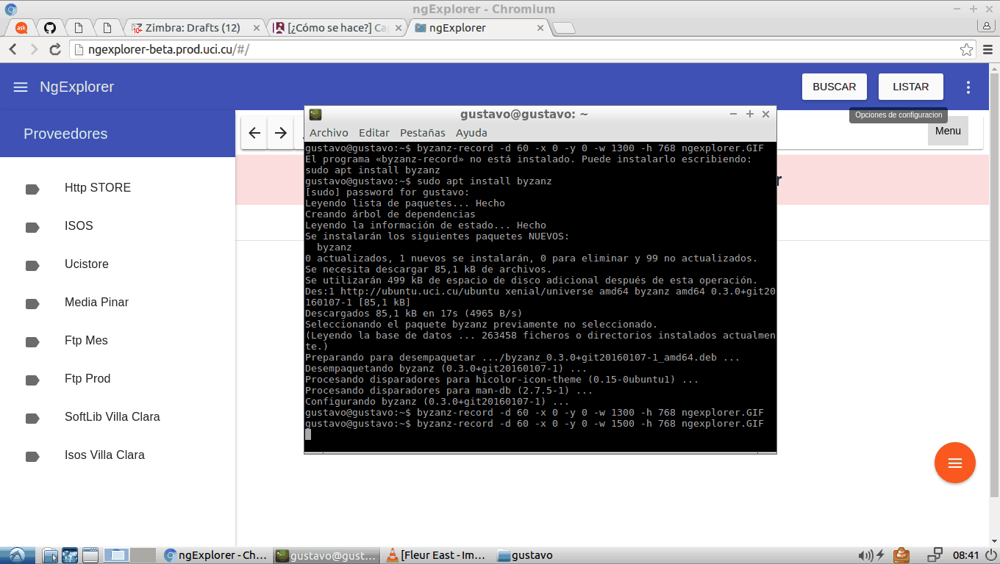

# ng-explorer

[Article](http://humanos.uci.cu/2016/04/presentando-ngexplorer-algo-mas-que-material-design-y-angularjs/)

## Setup project

1. Install Grunt globally: `npm install -g grunt-cli`.
2. Install npm dependencies: `npm install` and `cd serverNgexplorer` and `npm install`.
3. Install bower dependencies: `bower install`.
4. Run server in new instance `cd serverNgexplorer` and this `node server.js`.
5. Access your favorite browser to the path `http://127.0.0.1:3010`

## ElasticSearch integration

1. Configure file `/serverNgexplorer/config.js` to `elasticsearch.use: true` and `client.host`.

## Build & development

Run `grunt` for building and `grunt serve` for preview.
Run `grunt build --force` for to bring production mode.

## Client Vuejs

`http://127.0.0.1:3010/vue`

## Application running

